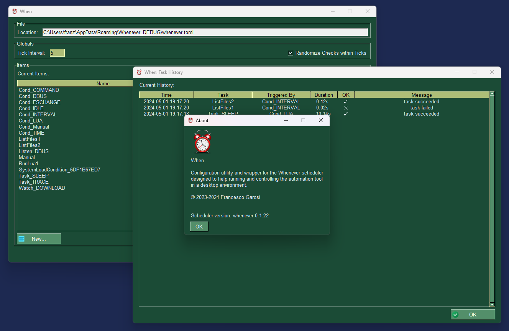

# When

This document describes the new version of **When**, a Python-based automation tool for the desktop. This version, instead of incorporating the scheduler, relies on the [**whenever**](https://github.com/almostearthling/whenever) automation tool, which focuses on reliability and lightweightness, while trying to achieve a good performance even when running at low priority. In this sense, **When** acts as a _wrapper_ for **whenever**, both providing a simple interface for configuration and an easy way to control the scheduler via an icon sitting in the tray area of your desktop. This version of **When** aims at being cross-platform, dynamically providing access to the features of **whenever** that are supported on the host environment.

The application is under active development: although not all of the desired features have been implemented yet, it is capable of running **whenever** in the background and to control it via an icon in the system tray, create and edit the configuration file, capture the log and display a history window. All of this trying to mimic the behaviour of the old **When** tool, which was only available on Ubuntu distributions and restricted to the 16.XX and 18.XX editions, entirely written in Python, and now abandoned because of the difficulty of adapting all needed DBus signals and checks to the ever-changing interface of the various Linux distributions.

Most of the interface of this release of **When** tries to be similar to the old version, although the need for cross-platform components pushes towards the adoption of the most widespread GUI library for Python, that is [_tkinter_](https://docs.python.org/3/library/tkinter.html). Also, some of the extra features that are built into **whenever** call for a somewhat less-streamlined interface especially in terms of form layout.

The [documentation](support/docs/main.md) is still underway, however it covers almost everything that is available in **When** .

## Usage

Please refer to the documentation for a simplified [installation procedure](support/docs/install.md) based on [pipx](https://pipx.pypa.io/), and for the [commands](support/docs/cli.md) available to configure and launch **When**. Also, [poetry](https://python-poetry.org/) can be used to run the application, which is particularly useful to start **When** from a source repository.

A simple [tutorial](support/docs/tutorial.md) is available to see some quick examples of common use cases.

## Compatibility

**When** has been successfully tested on Windows (10 and 11) and Linux (Debian 12). On Debian 12, however, it does not run OOTB: some additional packages are needed, as it does not ship with _tkinter_ support by default, nor it supports the _AppIndicator_ protocol in a Gnome session. Thus both `python3-tk` and `gir1.2-ayatanaappindicator3` need to be installed using the _apt_ package manager. Moreover, on _Wayland_ sessions the UI appears mangled and the graphic elements are actually unusable: it looks like _tkinter_ only works well in _Xorg_ sessions. Since Gnome does not support indicator icons direcltly, a Gnome shell extension capable of implementing this protocol has to be installed, such as [AppIndicator and KStatusNotifierItem Support](https://extensions.gnome.org/extension/615/appindicator-support/).

> **Note**: If **poetry** is used to launch the application on Linux (e.g. Debian 12), then the following option needs to be set in order to let the Python virtual environment access all the needed system modules: `poetry config virtualenvs.options.system-site-packages false` (possibly before the `poetry install` step). Otherwise Python can not reach the modules needed to display the system tray icon and menu.

## History

I started developing **When** years ago, because it was a kind of tool that I needed to automate _things_ during my desktop sessions. Most of the _things_ I needed to automate were related to organization of documents -- that is, moving them to the directories they belonged to, backing up stuff, cleaning up, and so on. At the time I used to stick to Linux (specifically, Ubuntu) desktops for my work, and one thing I noticed is that it lacked a tool as flexible as the _Task Scheduler_ in Windows: this scheduler, which is part of Windows itself, and is used by the OS to perform certain actions either on a time schedule or at the occurrence of a plethora of events, has a relatively modern user interface which is not too user-unfriendly and is highly configurable. All we had on Linux was _cron_, which has been around for some years now: it is a very powerful tool, yet it has some disadvantages over something like the above mentioned _Task Scheduler_. The most evident of these disadvantages is that it is exclusively time based. Of course, playing with time schedules and scripting can lead to every possible kind of tuning in order to decide what had to be met for certain actions to be performed. However, not everyone likes to build a complex script to automate routine actions that could have been kept simple. The second disadvantage is that there was no suitable desktop interface for cron of course there were GUI cron editors, but most of the ones I have tried were actually mere substitutes of _vi_ (or _nano_ for the ones who prefer it) in the sense that they possibly used a form to let you enter what you would have typed in your _crontab_ file: nevertheless you had to know how the _crontab_ file works in order to enter something correct in the input fields.

Thus, I started working on **When**: it was a Python application, with a not-that-terrible UI, which allowed to define tasks that could be triggered by specific _conditions_: these were something that resembled the _events_ and time schedules found in the _Task Scheduler_ on Windows, but sported maybe some more flexibility in the sense that **When** could also be active in looking for verified conditions, by running commands and scripts but also _checking_ directly (for instance via DBus queries) the session or system status. It has been useful to me, thus I kept updating it and it has supported mainly Ubuntu based distributions, from version 14.04 to version 18.10. After that I started using Windows too (especially on laptops). On the other hand, the services offered by DBus evolved a lot and many times their interfaces changed: it became difficult to keep the pace and redesign the hardwired event listeners in order to support the latest Ubuntu desktop and possibly at least the LTS editions which still had support. The only possibility was to redesign **When** to be more generic, remove the hardwired listeners and some of the specialized tasks and conditions and rebuild a more general (and flexible) scheduler that could support the features that were available at the time via some extra configuration and modules. This would have been easy with Python: the plan was to separate the main scheduler from the GUI, and let it run in the background as a smaller application which could be controlled by a GUI application (for example via DBus) and configured or reconfigured dynamically. This would have reduced the complexity of the scheduler at the expense of handling more complexity in the GUI, and would have reduced the memory footprint of the scheduelr itself when running alone -- with no GUI around.

However this remained a plan, mostly because I was gradually abandoning Linux (also driven by some of the choices that were made by the developers of desktop environments) in favor of Windows, and **When** remained quiescent for a while. Until I realized that I found it more flexible for my way of automating stuff, compared to the Windows _Task Scheduler_.

I started looking at **When** again, trying to imagine a way to port it to Windows (and maybe other Linux distributions), and one more time the only solution seemed to separate the scheduler logic from the configuration and controlling utilities. Almost at the same time I started developing an interest in [Rust](https://www.rust-lang.org/) as a development tool and stack. I rebooted **When** from scratch, although the concepts (mainly: _tasks_, _conditions_, and _events_) are the same as previously: the scheduler (it is called [whenever](https://github.com/almostearthling/whenever) now) had to be written in Rust, while the controlling GUI could be anything -- for instance, a Python application. And so it has been: **whenever** is generic and flexible, it compiles and runs on Linux and Windows, and is extremely lightweight. **When** too has been rewritten from scratch, especially because the Gnome API is not supported so well on Windows, but also because a prominent part of the aplication was the scheduler implementation. So **When** now is no more than a GUI shell around **whenever**: being possible to concentrate on this aspect, this shell can be more composite and focus on cross-compatibility, ease of use, and (last but not least) definition of specialized _items_ that can be implemented in **whenever**.

I use **When** and **whenever** on a daily basis, on several PCs, for the same types of actions that I used it for when i first started developing it.

## Credits

The clock [icon](http://www.graphicsfuel.com/2012/08/alarm-clock-icon-psd/) used for the application logo has been created by Rafi and is available at [GraphicsFuel](http://www.graphicsfuel.com/). All other icons have been found on [Icons8](https://icons8.com/):

* [Alarm Clock](https://icons8.com/icon/13026/alarm-clock)
* [Exclamation Mark](https://icons8.com/icon/j1rPetruM5Fl/exclamation-mark)
* [Question Mark](https://icons8.com/icon/cjUb4tRvBCNt/question-mark)
* [Settings Gear](https://icons8.com/icon/12784/settings)
* [OK (Check Mark) Button](https://icons8.com/icon/70yRC8npwT3d/check-mark)
* [Cancel Button](https://icons8.com/icon/fYgQxDaH069W/cancel)
* [Close Window](https://icons8.com/icon/rmf1Fvj5nBib/close-window)
* [Save](https://icons8.com/icon/yFBJCjFJpLXw/save)
* [Enter](https://icons8.com/icon/U5AcCk9kUWMk/enter)
* [Add](https://icons8.com/icon/IA4hgI5aWiHD/add)
* [Remove](https://icons8.com/icon/9lB4p3bBjCNX/remove)
* [Error](https://icons8.com/icon/hP6pCUyT8QGk/error)
* [New Document](https://icons8.com/icon/8tcDgihugAYf/new-document)
* [Pencil Drawing](https://icons8.com/icon/FnCPHMRRKpyL/pencil-drawing)
* [Delete](https://icons8.com/icon/pre7LivdxKxJ/delete)
* [File](https://icons8.com/icon/XWoSyGbnshH2/file)
* [Folder](https://icons8.com/icon/dINnkNb1FBl4/folder)
* [Task](https://icons8.com/icon/H0V90i8PgpQQ/task)
* [Medium Priority](https://icons8.com/icon/5339/medium-priority)
* [Switch](https://icons8.com/icon/IGjtJ2OuZ66s/switch)
* [Help](https://icons8.com/icon/0lWYxV5cUrMu/help)
* [Circle](https://icons8.com/icon/60362/filled-circle)
* [Square](https://icons8.com/icon/6RfZ-eZQz0ee/rounded-square)
* [Kite Shape](https://icons8.com/icon/122963/kite-shape)
* [Index](https://icons8.com/icon/18724/index)
* [Circled Play](https://icons8.com/icon/63671/circled-play)
* [Pause Squared](https://icons8.com/icon/110292/pause-squared)
* [Reset](https://icons8.com/icon/63693/restart)
* [Exit](https://icons8.com/icon/uVA8I3rgWfOs/logout)

This utility uses the beautiful [ttkbootstrap](https://github.com/israel-dryer/ttkbootstrap) theme extension for _tkinter_, which provides a modern look consistent on all supported platform (and which is probably more clean and clear than it used to be in the GTK days). Also, [chlorophyll](https://github.com/rdbende/chlorophyll) is used to display and edit code and structured text, providing a more pleasant and up to date UI, and [pystray](https://github.com/moses-palmer/pystray) to implement the system tray interface.
