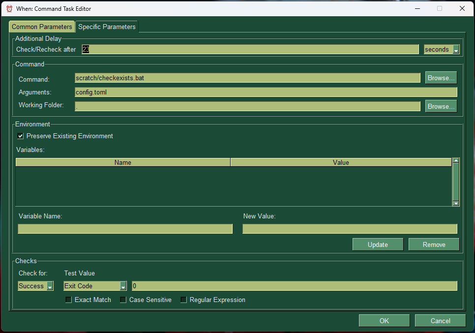

# When

This document describes the new version of **When**, a Python-based automation tool for the desktop. This version, instead of incorporating the scheduler, relies on the [**whenever**](https://github.com/almostearthling/whenever) automation tool, which focuses on reliability and lightweightness, while trying to achieve a good performance even when running at low priority. In this sense, **When** acts as a _wrapper_ for **whenever**, both providing a simple interface for configuration and an easy way to control the scheduler via an icon sitting in the tray area of your desktop. This version of **When** aims at being cross-platform, dynamically providing access to the features of **whenever** that are supported on the host environment.

This is still in its early development stage and still contains a lot of bugs and errors, yet it is capable of running **whenever** in the background and to control it via an icon in the system tray, create and edit a simple configuration file, capture the log and display a history window. All of this trying to mimic the behaviour of the old, _Ubuntu 16-to-18_ based **When** tool, which is entirely Python based and is now not actively developed anymore because of the difficulty of adapting all needed DBus signals and checks to the ever-changing interface of the various Linux distributions.


Most of the interface of this release of **When** tries to be similar to the old version, although the need for cross-platform components pushes towards the adoption of the most diffused GUI library for Python, that is [tkinter](https://docs.python.org/3/library/tkinter.html).



The documenttion is still underway, and the features are reduced compared to the old version of **When**. However the design of this new version is modular, and the design of **whenever** allows for the maximum flexibility in term of definitions of tasks, conditions, and events, so that new types of _usable_ events can be defined along with the forms to edit them easily and write a well-formed configuration file.


## Usage

This version of **When** uses [poetry](https://python-poetry.org/): after running `poetry install` in the project directory to install all necessary Python dependencies, **When** can be launched as follows:

```shell
when COMMAND [OPTIONS]
```

where `COMMAND` is one of the following:

- `config` to launch the configuration utility, without staying resident (i.e. no system tray icon)
- `start` to launch the **whenever** wrapper displaying the control icon on the system tray area
- `version` to display version information.

More commands might be supported in the future. `OPTIONS` are the possible options, some of which are command specific.

- `-D`/`--dir-appdata` _PATH_: specify the application data and configuration directory (default: _%APPDATA%\Whenever_ on Windows, _~/.whenever_ on Linux)
- `-W`/`--whenever` _PATH_: specify the path to the whenever executable (defaults to the one found in the PATH if any, otherwise exit with error)
- `-L`/`--log-level` _LEVEL_: specify the log level, all **whenever** levels are supported (default: _info_, specific to `start`)
- `-h`/`--help`: print help for the specific command

**NOTE**: For now **When** runs in _debug mode_, this means that it will sport a green-ish window style, will not catch exceptions, and will use a _DEBUG_ suffix for the application data directory. This behaviour can be modified by setting `'DEBUG': False` in the instantiation of `AppConfig` in _lib/repocfg.py_, instead of the current `True` value.

**When** will only work if a working version of **whenever** is available, either in the system _PATH_ or specified via the command line interface by using the `-W` switch.


## Credits

The clock [icon](http://www.graphicsfuel.com/2012/08/alarm-clock-icon-psd/) used for the application logo has been created by Rafi and is available at [GraphicsFuel](http://www.graphicsfuel.com/). All other icons have been found on [Icons8](https://icons8.com/):

* [Alarm Clock](https://icons8.com/icon/13026/alarm-clock)
* [Exclamation Mark](https://icons8.com/icon/j1rPetruM5Fl/exclamation-mark)
* [Question Mark](https://icons8.com/icon/cjUb4tRvBCNt/question-mark)
* [Settings Gear](https://icons8.com/icon/12784/settings)

This program uses a fork of [PySimpleGUI](https://www.pysimplegui.com/), namely [FreeSimpleGUI](https://github.com/spyoungtech/FreeSimpleGUI) which is on PyPI. The latest version of _PySimpleGUI_ is not open source anymore, and I'm fine with it: it is a useful package and deserves all possible support. However, **When** is an OSS project, and for the moment being I prefer to rely on libraries that do not require the end user to accept non-OSS license terms or to install third party license keys.
