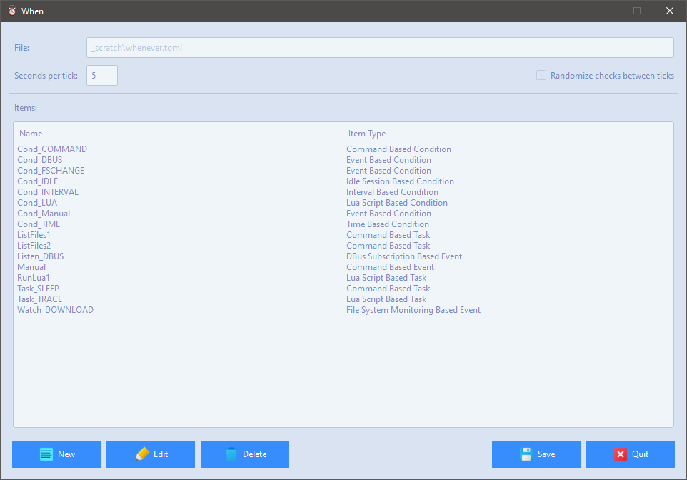

# Main Configuration Form

The _Main Configuration Form_ provides access to all _item_ editors that are available for the hosting platform.

This form allows to [review, edit](#edit-items), [remove](#remove-items), and [create](#create-items) _items_ in the current configuration file, as well as to modify the global, scheduler related [parameters](#scheduler-parameters). The configuration file path is shown in the top part of the form, for reference, and cannot be altered: this path ensures that the same configuration file can be used with either **When** or **whenever_tray** as the resident frontend (or _wrapper_) for the actual scheduler.

## Edit Items

An item can be edited by selecting its name row in the _Current Items_ list, and then clicking on the _Edit..._ button. This opens the appropriate item editor, displaying all the actual values for the selected item, in order to let the user modify them according to his needs or requirements.

## Create Items

By clicking the _New..._ button, a dialog will pop up asking which type of item has to be created: after selecting it and clicking _OK_ the appropriate editor opens for the desired item type. Note that mandatory parameters are set with default values: of course such values can be modified to suit the user's preferences. Item creation forms are, other than this, in no way different from the forms used to edit existing item parameters. These forms are specifically described throughout the documentation.

## Remove Items

Just clicking the _Remove_ button after selecting the item that has to be deleted will actually remove it from the configuration file, obviously after prompting for confirmation.

## Scheduler Parameters

The two global scheduler related parameters that are avaiable through this form are the following:

* _Tick Interval_: the amount of seconds that the scheduler will wait between subsequent checks that the defined, active conditions are verified: the default value is 5 seconds, which is actually frequent enough to ensure a quick reaction to external events;
* _Randomize Checks Within Ticks_: whether or not the actual execution of tests for each condition (excluding those that strictly depend on time) have to be performed at random instants within the tick interval or at the exact time when the interval has actually passed.

The second option, if checked, allows the scheduler to try to run tests for different conditions at a random instant within the interval between ticks. This allows to avoid running all the condition tests at the same time, which could in certain cases cause a significant load on the local machine. Unless there are specific reasons not to, it is advisable to check this option.

## Application Data

The _application data_ directory, often referred in this documentation as _APPDATA_ (from the name of the environment variable that, on _Windows_, determines its position within the user home directory), is where all persistent data common to **When**, **whenever**, and **whenever_tray** is kept. Its actual location depends on the host platform:

* `~/.whenever` on Linux
* `%APPDATA%\Whenever` on Windows
* `~/Library/Application Support/.whenever` on Mac.

Logs and configuration files can be found in this directory.

When launching the resident wrapper, the following parameter can be specified on the command line:

- `-D`/`--dir-appdata` _PATH_: specify the application data and configuration directory

However, it might be more useful _not_ to specify a custom _APPDATA_ directory unless really needed.

## Exiting

The _Exit_ button has different behaviours depending on how the main configuration form was entered: if a configuration-only session was launched using the `config` command, then the button allows for completely leaving the application. If the form was launched through the _Configurator..._ entry in the system tray menu, the resident part of **When** remains active, and only the configuration utility is exited. Please note that writing a new configuration file will not cause the main scheduler to automatically reload it.

Also note that, if anything had changed since the configuration file was last saved, the configuration form will ask anyway to save it again -- no matter whether it had been launched via the `config` command or via the system tray menu.

[`◀ Main`](main.md)
