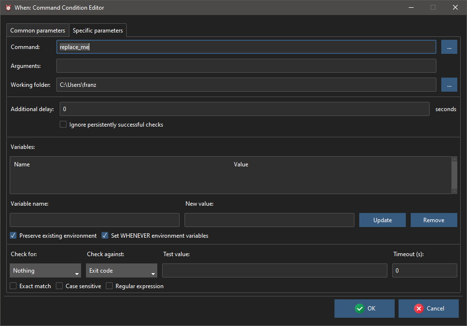
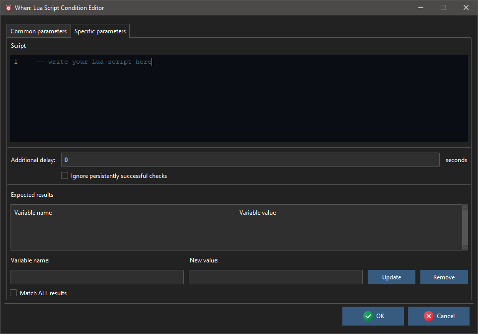

# Action Related Conditions

The condition items described in this section detrmine the outcome of the related tests as the result of a particular action, which can be either a command executed at the OS level, or the execution of a Lua script using the embedded interpreter. Since these tests might possibily be resource intensive, it is possible (and recommended) to specify an additional delay between consecutive checks by specifying an appropriate amount of time (in seconds, minutes, or hours) in the _Check/Recheck after_ field.

For the same reason, the tests related to these types of condition might be performed at a random instant between two scheduler ticks if the corresponding global scheduler [option](cfgform.md#scheduler-parameters) is set.

## Command

Command conditions execute a command at the OS level which can be any kind of executable, that is, both scripts and binaries are accepted command. The command, along with its arguments and startup folder, must be provided by the user. The outcome of the condition is determined by either checking the exit code or scanning the output provided by the command.

The definition of the related command and of the tests that are performed to determine its outcome is very similar to the corresponding [task](tasks.md#command) definition.

The following entries must be specified:

* _Command_: must either be the full path to an executable, or a command that can be found in the current execution _PATH_
* _Arguments_: the arguments, if any, to be passed to the command
* _Working Folder_: the directory where the command is started by the OS.

If the working folder is not important for command execution, a simple dot (`.`) can be entered to specify the "current folder": the field can not be empty.

The _environment variables_ deserve special consideration:

* by checking _Preserve Existing Environment_ (default, recommended) the command starts with all the already defined variables, otherwise a fresh, empty environment is created
* the _Set..._ flag, if checked, _adds_ one more variable, that is _WHENEVER_CONDITION_, containing the name of the condition
* more environment variables can be defined for the specific command: for this, it is sufficient to enter the variable name and the value in the respective fields, and click the _Update_ button; to remove a variable it is sufficient to enter its name in the _Variable Name_ field (or double click the entry in the list) and then click the _Remove_ button. Clicking _Update_ by providing a new value for an existing variable will update its value in the list.

Variables provided in the list will add up to the existing ones, or _overwrite_ the ones that share the same name.

The _Checks_ section allows to test the outcome of commands by examining their output (either _stdout_ or _stderr_) or the exit code. When selecting _Success_ in the _Check for_ drop down list, meeting the criteria provided on the right will be considered a success. Selecting _Failure_ will cause the same event to be considered a failure. In the same section, the flags below change the way the provided result is compared against the selected output (_stdout_ or _stderr_ only: ignored when the exit code is considered): _Exact Match_ indicates that the output is matched against the provided string in its entirety (by default it is sufficient to find the provided string as a substring), _Case Sensitive_ obviously considers uppercase and lowercase letters differently, while _Regular Expression_ considers the provided string as a regular expression to match against the command output, either in its entirety or just partially depending on whether _Exact Match_ is respectively checked or unchecked.

The _Timeout_ parameter can be set to a specified number of seconds in order to force a command which can hang or take a long time to complete to stop after the provided time. In terms of outcome, a timeout terminated command is always considered as failed. The provided value must be a positive integer, to avoid timeout checking field must be left empty.

## Lua Script

As a lightweight alternative to OS level commands, it is possible to run _Lua_ scripts: since the _Lua_ interpreter is embedded in the scheduler executable, execution of simple _Lua_ scripts may have less impact on computational resources than equivalent tests that require commands. The interpreter is provided with its full library, and although the script has to be specified in the scheduler configuration, it is possible to use the `require()` and `dofile()` functions to call external scripts.

Success and failure of _Lua_ based tests are determined by the correspondence of the values held by some variables after the script execution. The variables to be checked are provided by the user by entering the variable name and the expected value respectively in the _Variable Name_ and _New Value_ fields, and clicking the _Update_ button: the behaviour of the list, the aforementioned fields and the _Update_ and _Remove_ buttons are similar to the ones seen for the _environment variables_ in [command based conditions](#command). Checking the _Match ALL Results_ box will cause the test to be successful only when **all** listed variables hold the expected values, while by default just one match among the listed ones is sufficient for success.

[`◀ Conditions`](conditions.md)
