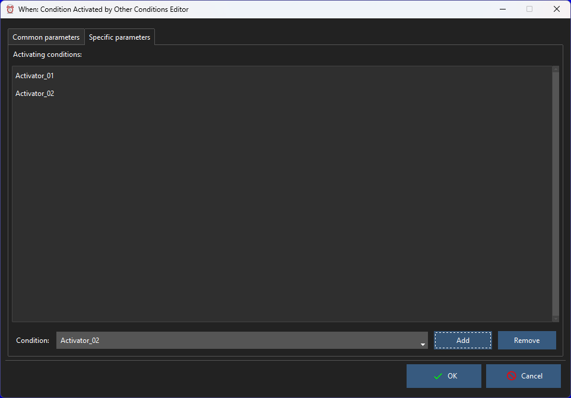

# Conditions Activated by Other Conditions

These conditions are specifically built to be the consequence of the verification of other conditions. The specific parameter tab will display of list of _activating_ conditions that, after their verification, will cause the current condition to be verified.

To add a condition to the list, it is sufficient to select it from the box below the list, and click the _Add_ button. There are some constraints:

* the conditions that appear in the box are only the ones that have been configured to _activate further conditions_,
* it would be useless, and there fore it is not possible, to add a condition twice,
* it is not possible to use a condition of this type to _activate further conditions_: the specific check box in the common parameters tab is disabled,
* at least two _activating_ conditions must be in the list for the configuration to be valid.

These constraints are enforced by the form, but they should be considered just obvious: condition duplication and the use of this type of conditions to create complicated chains is discouraged.

Although it might seem complex, the workflow is quite simple: _after_ **all** the conditions listed in the list of _activating conditions_ are verified, the tasks associated to the current condition are run, as with every other type of condition. In this sentence, the word _after_ is intentionally used: there is no concept of simultaneos validity of the conditions that activate the current one. This should give a hint on what conditions are more suitable to be used to concur in the activation of another, or at least which ones should _not_ anyway. In the category of conditions that are not ideal for this use, the following generically described kinds should be counted:

* conditions that depend on the status of the system in a particular instant, for example on the current load,
* conditions that take into account interaction with the user, such as idle time or presence of removable drives,
* conditions that are verified at certain instants in time,

as well as, possibily, other types. Other conditions, such as time intervals, availability of certain files or resources that do not strictly depend on user interaction, and under certain circumstances automatic session locks[^1] can be appropriate candidates for _condition confluence_. However, **When** does not limit what conditions can be used for this purpose, and even by exploiting the less encouraged types, there might be the opportunity to use this feature productively.

[`◀ Conditions`](conditions.md)

[^1]: However, **when** and **whenever** do not consider _automatic_ and _manual_ session locks as different conditions or events.
