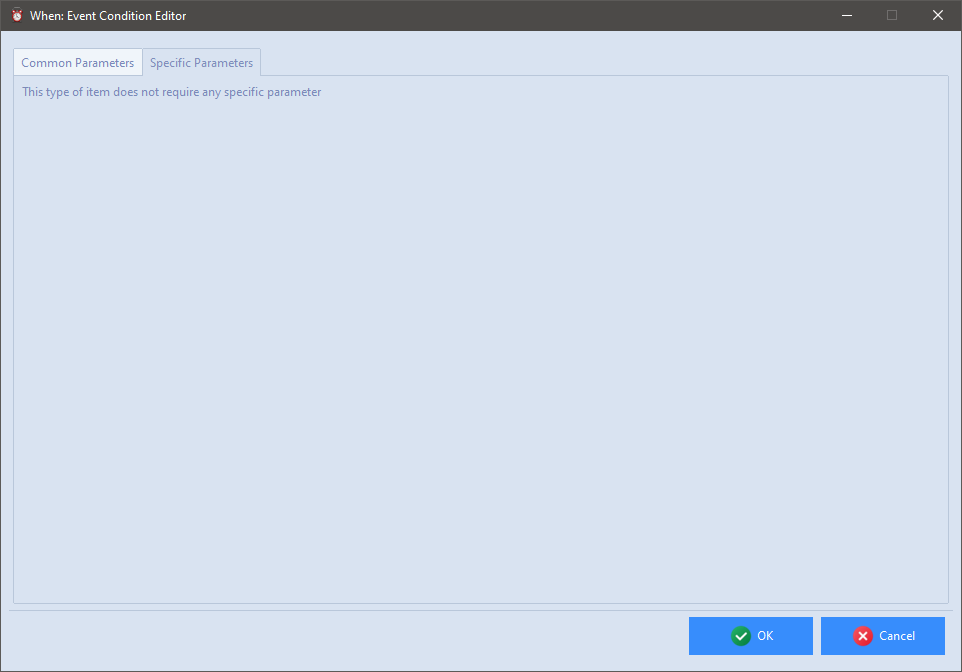

# Event Conditions

Event based conditions are the simplest ones in terms of definition: there are no specific parameters to be set, because it is left to the [events](events.md) to decide what condition has to be fired.

Therefore, the _Specific Parameters_ panel only displays a notice stating that no particular configuration is required.

Since this type of conditions is not time related, the related check might be performed at a random time between two scheduler ticks if the corresponding global scheduler [option](cfgform.md#scheduler-parameters) is set.

[`◀ Conditions`](conditions.md)
