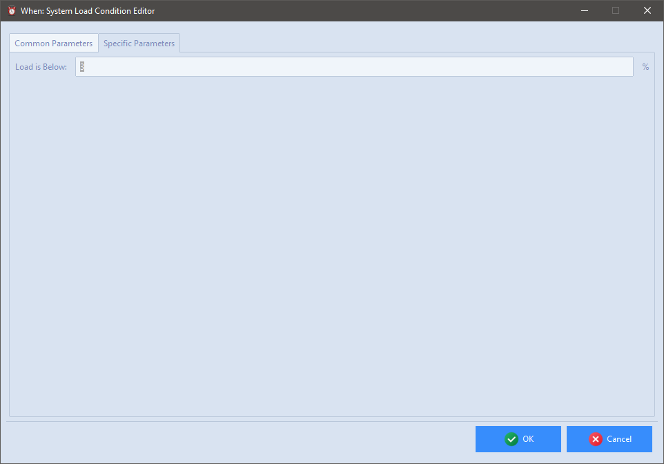
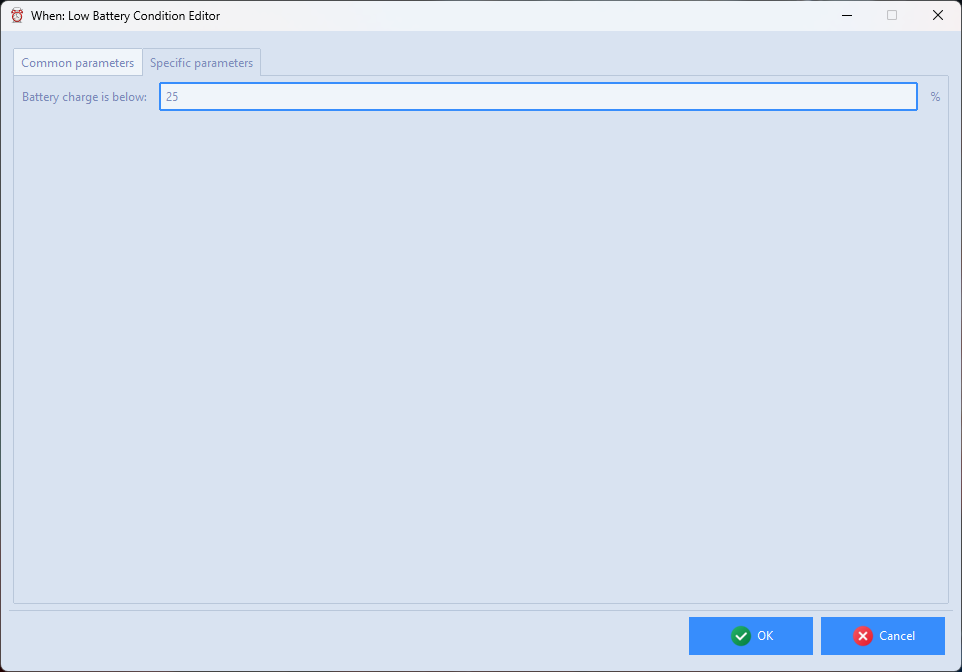

# Extra Conditions

The condition items described here cover various different aspects of a session, and their availability may vary depending on the hosting platform and the presence of certain features.

## System Load

This test verifies whether or not the system load is below a certain percentage and, if so, runs the related tasks. The only available specific parameter is the percentage treshold below which the test is considered successful.

The item can be used on Windows and Linux systems, and depends on the availability of the _PowerShell_ in the first case, and the presence of the `vmstat` and `bc` OS commands in the latter, which may need to be installed on some distributions. The checks for this condition are performed about every minute.

## Low Battery

This test checks whether the battery is draining and its charge is below a certain percentage and, if so, runs the related tasks. The only available specific parameter is the percentage treshold below which the test is considered successful.

The item can be used on Windows and Linux systems, and depends on the availability of the _PowerShell_ in the first case, and the presence of the `upower`, `grep`, `awk`, and `sed` OS commands in the latter, which are usually installed by default. The checks for this condition are performed about every five minutes.

## Charging Battery

This test checks whether the battery is charging and its charge is above a certain percentage and, if so, runs the related tasks. The only available specific parameter is the percentage treshold above which the test is considered successful.

The item can be used on Windows and Linux systems, and depends on the availability of the _PowerShell_ in the first case, and the presence of the `upower`, `grep`, `awk`, and `sed` OS commands in the latter, which are usually installed by default. The checks for this condition are performed about every five minutes.

## Removable Drives

Definition forms to check for presence of a removable drive are available, both for Windows and for Linux. The behavior and configuration is slightly different depending on the host platform.

### Windows

On Windows, the _label_ of the removable drive has to be specified in order to be somewhat more selective in choosing which removable drive has been made available to the workstation: the label can be edited by any windows user, so it's possible to appropriately set labels for thumb drives, cards, and so on, in a way that helps select tasks to be executed when a removable drive is inserted.

The label has to be specified by the user with no assistance: the exact string to be checked must be entered. Optionally, by checking the appropriate box, it is possible to specify on which drive letter the support is supposed to be auto-mounted: this is another parameter for fine-tuning, since often Windows reuses the same drive letter when the same removable drive is used.

### Linux

On Linux, it's only possible to choose among a system-determined list of available removable drive _names_, or it is possible for the user to specify the exact name: since these names are not always easy to remember, it is suggested that the removable storage to monitor is inserted when creating the condition in **whenever**, so that its name appears in the list.

It is not possible to specify the expected mount point: its determination, which depends on the specific Linux distribution and configuration, is up to the user.

## See also

* [Command Based Conditions](cond_actionrelated.md#command)
* [Lua Script Based Conditions](cond_actionrelated.md#lua-script)

[`◀ Conditions`](conditions.md)
