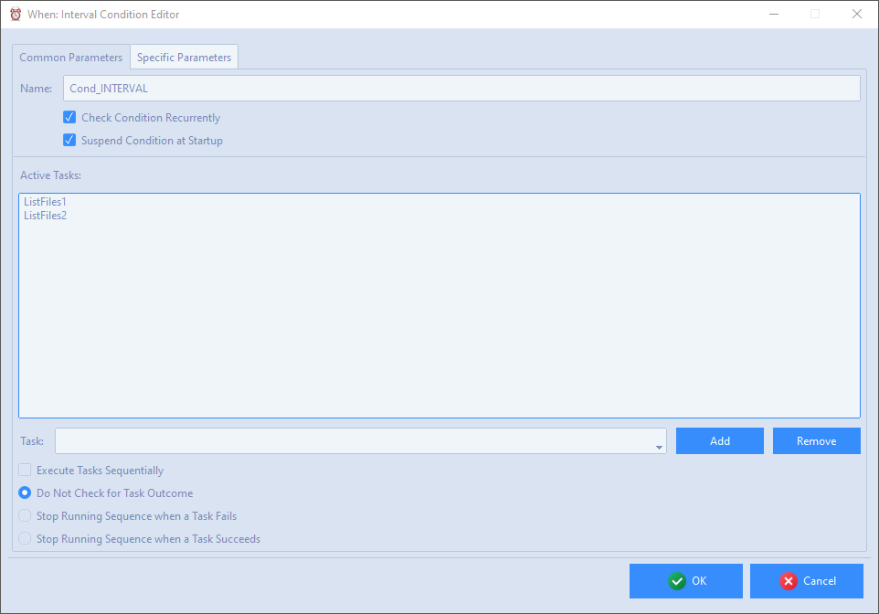

# Time Related Conditions

The condition items described in this section depend on time checking, therefore the related tests will always be performed exactly at the scheduler tick: this means that such tests ar never performed [at a random instant](cfgform.md#modify-scheduler-parameters) between two ticks.

## Interval

Interval based conditions are possibly the simplest ones: verification depends on the passing of a certain amount of time since the start of the scheduler. In combination with the _recurring_ flag (in the common section) leads to _periodic_ conditions, that is, occurring every time the specified interval passes.

The only available parameter is the _interval duration_, that may be specified in seconds, minutes, or hours.

## Time Specification

This type of condition overlaps with the common, system provided time based scheduler. One or more time specifications can be provided, at which the condition is verified. The time specification can be given indicating a (partial) instant, by filling part of the entries in the row above the time specification list. Omitting part of the entries has different effects depending on which ones are omitted. Generally, specifying the date entries and omitting the time related ones indicates that the condition occurs at midnight at the specified date. Omitting the year indicates that the condition occurs every specified month and day at midnight. Omitting year and month and specifying day _N_ indicates that the condition occurs every day _N_ of the month in all months (unless, of course, _N_ is above 28 or 29, which excludes some months). Specifying a day of the week of course indicates the occurrence every that day of the week. Providing hours, minutes and seconds restricts occurrence to the specified time. If no date or weekday are specified, the condition occurs every day at the specified time, but in this case, when the hour is omitted, the occurrence happens every hour at the specified minute (and second if provided).

The list tries to display the provided specifications in human-readable form. In order to add a specification, once the necessary fields are filled, it is sufficient to click the _Add_ button. To remove a specification it must be double clicked in the list, and then the _Remove_ button must be clicked. The _Clear_ button in the first row is useful to clear all the entries at its left (it does not modify the list contents). To remove _all_ provided time specifications at once, the _Clear All_ button is available in the lower part of the form.

Note that, if the condition is not recurrent, it will occur when just _one_ of the provided time specifications is reached for the first time.

## Idle Session

This condition occurs after a certain time has passed since there was any type of user interaction (mouse, keyboard, touch screen, etc.) with the current session.

The only available parameter is the _duration of the idle session_, that may be specified in seconds, minutes, or hours. In this case specifying the condition as _recurring_ will cause it to occur again if the session exits its idle state first, and then returns idle for the same amount of time.

> **Note**: formally _Wayland_ based Linux desktops are supported by **whenever** and therefore by **When**. However, in case the _X.org_ libraries related to idle time (namely, _libx11-dev_ and _libxss-dev_), the **whenever** binary must be specifically built for these platforms: these binaries calculate the _idle time_ as the time spent when the session is _locked_ instead of considering the last time that an user interacted with the desktop. The provided binary distributions actually support desktops where _X.org_ is available.

[`◀ Conditions`](conditions.md)
