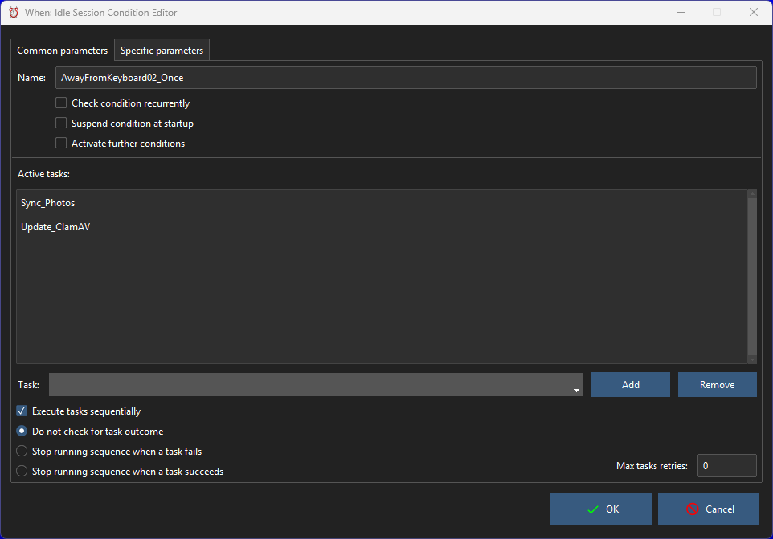

# Condition Editors

All condition editors share a common part, which encompasses all parameters that are common to all condition items:

It allows to set the mandatory item _Name_ (an alphanumeric string beginning either with a letter or an underscore), the tasks associated with it, and to decide other behaviors specific to conditions:

* _Check Condition Recurrently_: when set, the condition is continuously re-checked even after its verification, becoming _recurrent_. By default a verified condition stops being checked after the first occurrence, unless a [_reset conditions_](tray.md) command is sent via the system tray menu.
* _Max Task Retries_: when greater or equal to `0`, the number of times that the underlying scheduler will _retry_ to run the associated task or list of tasks in case one of them fails (of course `0` means _only one check and no retries_); a value of `-1` means that the scheduler will try to run the associated task(s) forever until they all succeed. Only available if the _Check Condition Recurrently_ flag is set.
* _Suspend Condition at Startup_: to start the condition in suspended mode, which means that it will not be checked during the session.

The central list displays the list of tasks associated with the condition, in the order in which they would be run in case the _Execute Tasks Sequentially_ box is checked (otherwise, all tasks are spawned simultaneously). To add a task to the list, it must be selected from the drop down list below the list and the _Add_ button must be clicked. To remove a task, it must be double clicked on the list (or selected in the drop down list, with the same effect) and the _Remove_ button has to be clicked. Note that all occurrences of the task displayed in the text box are removed from the list.

When the tasks are set to be run sequentially, the behavior upon success or failure of one of them (that is: stop the sequence on either success or failure) can be specified, by clicking the appropriate option, respectively the _Stop Running Sequence when a Task Succeeds/Fails_ options. Leave the _Do Not Check for Task Outcome_ selected to ignore the outcome of the associated tasks.

These are the parameters that appear on the _Common Parameters_ tab: the _Specific Parameters_ tab, instead, varies according to the type of condition that is being edited.

The conditions available in **When** that are natively supported by **whenever** are the following:

* [_Command_ conditions](cond_actionrelated.md#command)
* [_Event_ conditions](cond_eventrelated.md)
* [_Idle Session_ conditions](cond_timerelated.md#idle-session)
* [Time _Interval_ conditions](cond_timerelated.md#interval)
* [_Lua Script_ conditions](cond_actionrelated.md#lua-script)
* [_Time_ conditions](cond_timerelated.md#time-specification)

Other conditions are supported, that are implemented as reactions to particular commands, DBus messages or method invocations, _Lua_ scripts. These conditions appear along with the native ones, and the related documentation can be found at the following locations:

* [_System Load_ below Threshold](cond_extra01.md#system-load) conditions
* [_Battery Charge_ below Threshold](cond_extra01.md#low-battery) conditions
* [_Battery Charge_ above Threshold](cond_extra01.md#charging-battery) conditions
* [_Removable Drive_ available](cond_extra01.md#removable-drives) conditions

The above list will grow with time, along with the discovery of new configuration possibilities on the supported platforms and the development of the related forms.

## See Also

* [Tasks](tasks.md)
* [Events](events.md)

[`◀ Main`](main.md)
