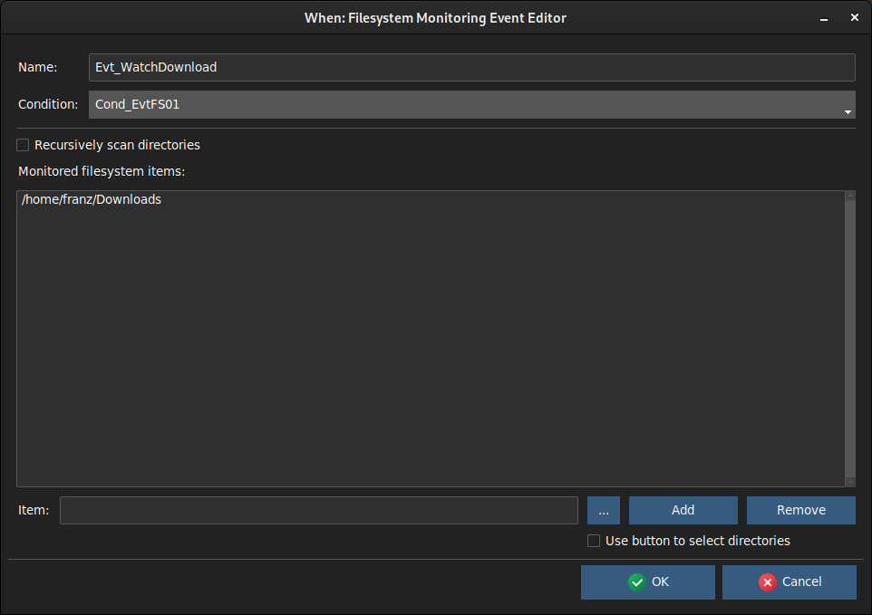

# Native Events Editors

The only type of event editable in **When** that is natively supported by the scheduler is the one that depends on changes in files and directories that are monitored by the operating system.

## File System Monitoring

This type of event fires whenever one of the monitored files or directories undergoes a modification: for files it means that its contents or metadata are altered, for directories it also occurs when there is a change in the files that it contains. In the latter case, subdirectories are also monitored if the _Recursive_ flag is set.

The event _Name_ is mandatory and must be an alphanumeric string beginning with a letter or an underscore. The associated _Condition_ is also mandatory, and must be selected among the appropriate ones using the drop down list.

The items (files and directories) to be monitored can be provided by entering their path in the _Item_ fiels below the list, and then checking the _Add_ button to populate the list: the button on the right provides a convenient way to browse the filesystem and select objects. To remove an item, double click it on the list and then click the _Remove_ button.

> **Note**: for the moment it is impossible to browse for directories using the browse button, it is however possible to select a file within the directory and remove the file basename from the resulting string in the _Item_ field before clicking the _Add_ button.
