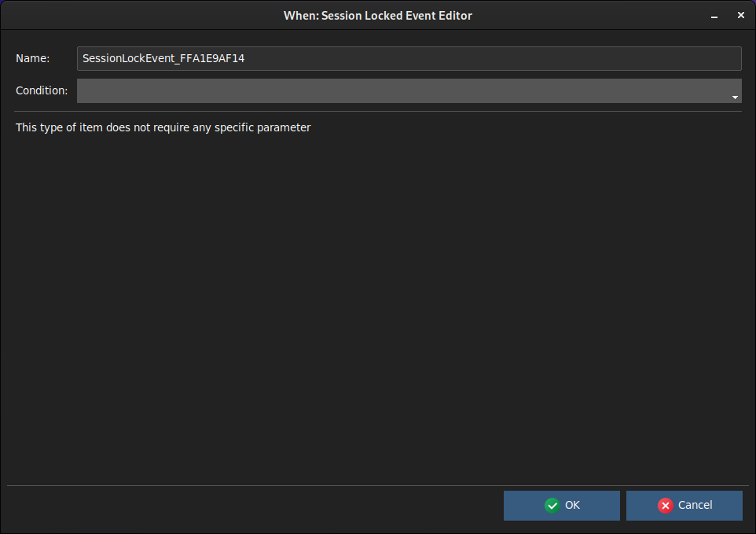

# Specific Events

The condition items described here cover various different aspects of a session, and their availability may vary depending on the hosting platform and the presence of certain features.

## Session Locked/Unlocked Events (Linux)

The _Session Locked Event_ and _Session Unlocked Event_ occur, as it might result quite obvious, respectively when the session is either locked or unlocked. No matter whether the workstation has been locked voluntarily or by the session manager after a certain period of inactivity: **When** catches the event in both cases -- in this it does not overlap with [idle session](cond_timerelated.md#idle-session) based conditions.

Both types of event do not require specific parameters: only the name should be set to something meaningful and an [event based condition](cond_eventrelated.md#event-conditions) _must_ be associated to the event.

## See also

* [Event Based Conditions](cond_eventrelated.md)
* [File System Monitoring Events](events.md#file-system-monitoring)
* [Events](events.md)
* [Conditions](conditions.md)
* [Tasks](tasks.md)

[`◀ Events`](events.md)
