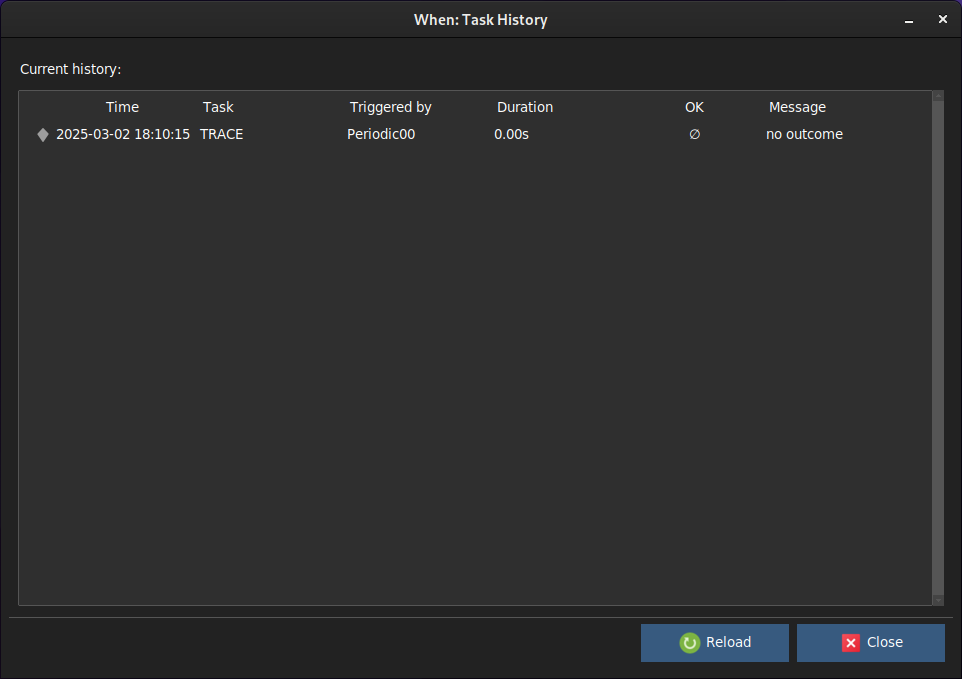

# History Box

This simple dialog shows the tasks that have been executed by the scheduler in reaction to conditions.

The list, representing the last completed tasks in descending time order (that is, the first row shows the most recent task), shows the following information:

* _Time_: the time at which the task started running
* _Task_: the name of the executed task
* _Triggered By_: the name of the condition that triggered the task
* _Duration_: the duration of the task, in seconds
* _OK_: a sign indicating the outcome: a checkmark for a positive outcome, a cross for a negative one, the empty set sign for undetermined results
* _Message_: additional information provided by **whenever**

The history box does not capture results in real time, it just displays the results at the time of its display. Only the latest 100 results are displayed -- this might become a configurable parameter in further versions.

[`◀ Main`](main.md)
