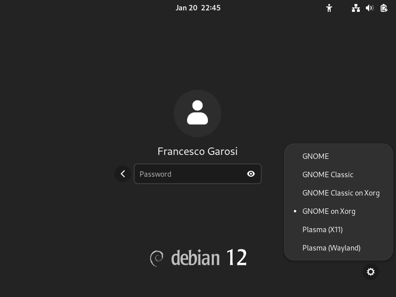
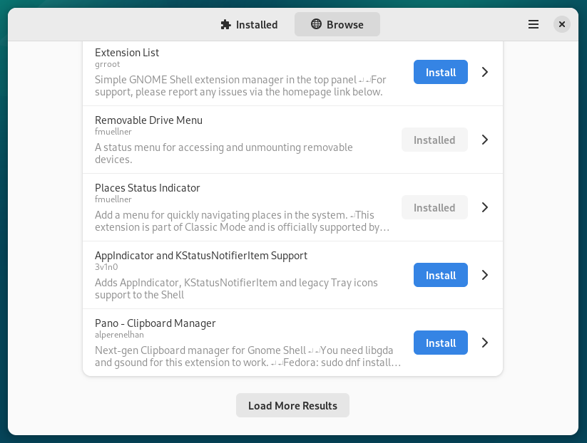

# Installation

The easiest way to install _When_ is using [pipx](https://pipx.pypa.io/): this works both on [Windows](#windows) and [Linux](#linux), at least in the tested distributions. Installation on Linux is somewhat more complicated due to the need of fulfilling the requirements before successfully running the application. On Windows the requirements are easier to deal with, in the sense that only [Python](https://www.python.org/), [git](https://git-scm.com/)[^1], and [pipx](https://pipx.pypa.io/) need to be installed.

Requirements:

* [Python](https://www.python.org/) in a recent release (at least version 3.11)
* [pipx](https://pipx.pypa.io/)
* [git](https://git-scm.com/)
* [whenever](https://github.com/almostearthling/whenever), possibly the latest binary [release](https://github.com/almostearthling/whenever/releases)

## Windows

The following steps can be followed on both Windows 10 and Windows 11:

1. install **Python** and **git**[^1] using the provided installers
2. install pipx by issuing the command `py -m pip install --user pipx` in a console window: after installation launch `pipx ensurepath` from the command prompt
3. download the latest release of **whenever** from the [releases page](https://github.com/almostearthling/whenever/releases), extract its contents and copy the two executables, _whenever.exe_ and _whenever_tray.exe_ to `%USERPROFILE%\.local\bin` (which has been created by **pipx**)
4. install **When** from its stable branch, using **pipx**: `pipx install git+https://github.com/almostearthling/when-command.git`
5. close the current console window, and open a new one: this is to ensure that the updated `PATH` environemnt variable is active
6. launch the configuration utility, by typing `when config` on the command line: create a task and a condition of your choice, and save the configuration file by clicking the _Save_ button.

Once a configuration is available, the resident application can be started from the command line using the `when start` command. A shortcut can be created, using just `when start` a the command to execute, using the tools provided by Windows in order to add it to the _Startup Applications_. Development of an automated way to achieve this is underway.

On Windows, the command `when-bg` can be used instead of `when` in order to launch the application _detached_ from a console window: when creating shortcuts, either to launch the [configuration utility](cfgform.md) or to start the [resident tray frontend](tray.md), it is better to use `when-bg` in order to avoid having a foreground console window in the way.

## Linux

The following steps can be followed on an updated version of Debian Linux 12:

1. start a Gnome session using Xorg as a backend

   

2. as root, install the development toolchain: `su - root -c "apt install build-essential"` (enter the root password when prompted)
3. as root, install the _Gnome shell extension manager_: `su - root -c "apt install gnome-shell-extension-manager python3-pip pipx"` (same as above)
4. in a different terminal window, not as root, launch `pipx ensurepath` from the terminal
5. download the latest release of **whenever** from the [releases page](https://github.com/almostearthling/whenever/releases), extract its contents and copy the two executables, _whenever_ and _whenever_tray_ to `$HOME/.local/bin` (which has been created by **pipx**)
6. as root, install the **pip** and **pipx** Python modules: `su - root -c "apt install python3-pip pipx"` (same as above)
7. start the _Gnome shell extension manager_, named simply _Extension Manager_ in the activities dashboard
8. choose the _Browse_ tab and scroll down to find _AppIndicator and KStatusNotifierItem Support_ and install it

   

9. install **When** from its stable branch, using **pipx**: `pipx install git+https://github.com/almostearthling/when-command.git`
10. close the current console window, and open a new one: this is to ensure that the updated `PATH` environemnt variable is active
11. launch the configuration utility, by typing `when config` on the command line: create a task and a condition of your choice, and save the configuration file by clicking the _Save_ button.

Once a configuration is available, the resident application can be started from the command line using the `when start` command. A shortcut can be created, using just `when start` a the command to execute, using the tools provided by Gnome in order to add it to the _Startup Applications_. Development of an automated way to achieve this is underway. The `when-bg` command also exists on Linux, but its behaviour is absolutely identical to `when`.

[`◀ Main`](main.md)

[^1]: only temporarily: **git** should not be needed anymore when a _ZIP_ release will be made available.
