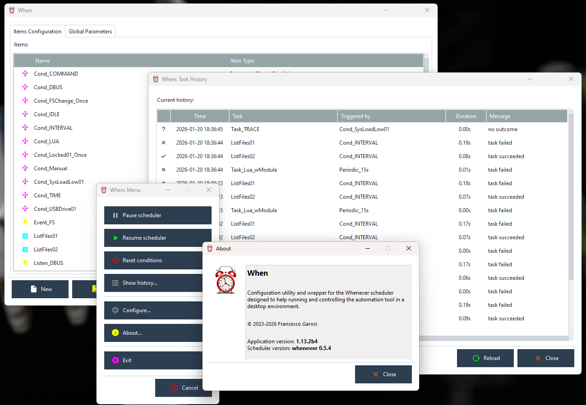

# The **When** Documentation

## What is When?

**When** is an automation tool for desktop environments: it is implemented as a GUI application that offers the possibility to define certain conditions which, when satisfied, cause certain tasks to be performed. Conditions can be of various kinds: time intervals or specific instants in time, session status, probing the current status of the system, messages or signals sent by the system or by other applications.

The **When** application is written in Python, with the goal of possibly providing a single UI for different hosting platforms. It actually does not implement the automation tool by itself but relies instead on an "external" tool, [**whenever**](https://github.com/almostearthling/whenever), as its actual scheduler, by launching it as a child process. This separate process is designed, however, to be very lightweight and performance-oriented: thus the computational resources needed for it are probably less than the ones that implementing the scheduler within **When** would have needed.[^1]

Actually, **When** consists of several different applications which are launched by issuing the specific commands on the [command line](cli.md):

* [configuration-only](cfgform.md) application: `config`
* resident [tray area](tray.md) application: `start`
* various helpful [utilities](cli.md#toolbox): `tool`
* ...

See the specific parts of the documentation for details on each application. The suggested [installation procedure](install.md), however, can be used to set up application icons for the resident application and for the configuration utility, as well as to configure **When** to start in the background at login.

:::{note}
Sometimes you will find suspension points in lists (like the one above) throughout this documentation: this does not mean that part of the documentation is missing or that there are some undocumented features. Suspension points like these indicate that the list might grow in the future.
:::

## About this Documentation

This is the main **When** documentation: it covers the new version of the application, that is, the wrapper for the **whenever** scheduler and automation tool. It aims at providing an easy to use frontend for the scheduler, both as a cross platform launcher in desktop environments, and as a configuration tool. **When** as a configuration tool also tries to provide a way to easily specify tasks and conditions that are not natively supported by **whenever** and that would be difficult to implement by hand, encoding them directly in **whenever** using its TOML configuration file. **When** tries to support all platforms supported by **whenever** itself, and to provide tasks, conditions, and events (both native and specialized) that are available on each single platform.

This document references:

* [**whenever**](https://github.com/almostearthling/whenever): the main scheduler and automation tool used by **When**;
* [**whenever_tray**](https://github.com/almostearthling/whenever_tray): a minimal, lightweight, cross platform wrapper and frontend for **whenever**.

The first is the main core that **When** uses to accomplish its mission: unlike the previous version, **When** totally relies on **whenever** as its internal engine instead of implementing a scheduler on its own. The second can be considered as a complement to **When**, in the sense that **When** is designed to share its configuration location with **whenever_tray** in an interoperable way that would allow the latter to be launched as an alternate frontend for running **whenever** after having configured it with the help of **When**.

:::{tip}
A configuration file generated with **When** will still work in case **whenever** is started by an alternate frontend, or even on its own. This includes advanced features such as the ability to [_reset conditions on system resume_](cfgform.md#modify-scheduler-parameters), or the [_conditions activated by other conditions_](cond_confluence.md), as well as the specific items. Some of these features, however, require **When** to be _installed_ (although not _running_), because they depend on resources (for instance, _Lua_ scripts), that are located in the **When** installation tree. Apart from that, the configuration is read by **whenever** as a definitely regular configuration file.
:::

## Covered Topics

The documentation handles the following topics:

* [Installation](install.md)
* [CLI](cli.md)
* [System Tray Resident Application](tray.md)
* [Main Configuration Form](cfgform.md)
* [Task](tasks.md) Editors
* [Condition](conditions.md) Editors
* [Event](events.md) Editors
* [Toolbox](cli.md#toolbox)
* Simple [Tutorial](tutorial.md)
* Generated [Configuration Files](configfile.md)
* [Localization](i18n.md)

For more information about the companion tools, **whenever** and **whenever_tray**, please refer to their respective above-mentioned repositories.

## Glossary

For the sake of readability, a glossary follows for some of the terms used throughout this documentation.

| **Term**           | **Meaning**                                                                                                                                 |
|--------------------|---------------------------------------------------------------------------------------------------------------------------------------------|
| _APPDATA_          | the _application data_ directory is where **When** keeps configuration files, data files, and logs: see [this page](appdata.md) for details |
| _condition_        | circumstance or set of circumstances that may or may not occur in a certain moment and whose occurrence determines the execution of tasks   |
| _event_            | signal, message, or external coincidence anyway that **When** (or **whenever**) can be instructed to listen to                              |
| _item_             | used throughout the document to specify one of a _task_, a _condition_ or an _event_                                                        |
| _system tray area_ | area of the desktop where background-running applications show an icon and notifications: goes by several other names                       |
| _task_             | an action that **When** will perform upon verification of a certain _condition_                                                             |
| _tick_             | the instant in which the tests for condition verification are started and possibly consequential tasks are launched                         |
| ...                | ...                                                                                                                                         |

[^1]: this actually fulfills what was requested in Issue #85.
