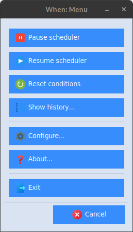

# System Tray Resident Application

The system tray resident wrapper to **whenever** is launched via the `start` command or via the _When Start_ desktop or menu icon: it launches the **whenever** scheduler executable in the background, also avoiding to show the console window on _Windows_ desktops, and taking care to capture the scheduler output, interpret it to keep track of the tasks that have been executed along with their outcomes, and write the scheduler log to the [_application data_](appdata.md) directory. The resident wrapper also displays a clock icon in the tray area, meaning that the scheduler is active, which can be right-clicked (left-clicked on some Linux machines, see below) to allow a certain degree of interaction with the underlying scheduler itself.

The available entries are:

* _Pause/Resume Scheduler_: respectively pause scheduler checks or resume them; when the scheduler is paused no condition checks are performed and thus no tasks are launched. This does not affect however currently running tasks which keep running until their conclusion or until a timeout has been reached. When the scheduler is paused, the clock icon appears grayed out.
* _Reset Conditions_: reset the status of all conditions, and in particular consider all _non recurrent_ conditions that were verified during the session (and that, therefore, would not be checked anymore) as _not_ verified, thus restarting checks.
* _Show History_: display the [_History Box_](history.md), a streamlined viewer that displays the tasks that have been executed along with their outcomes.
* _Configurator_: display the [configuration application](cfgform.md).
* _About_: display a simple information box.
* _Exit_: stop the underlying scheduler and exit the resident application: this may require some time because **When** waits for all the tasks to finish before releasing the scheduler.[^1]

When launching the resident wrapper, the following parameters can be specified on the command line:

- `-D`/`--dir-appdata` _PATH_: specify the application data and configuration directory
- `-W`/`--whenever` _PATH_: specify the path to the whenever executable (defaults to the one found in the PATH if any, otherwise exit with error)
- `-L`/`--log-level` _LEVEL_: specify the log level, all **whenever** levels are supported (default: _info_, possible values are _error_, _warn_, _info_, _debug_, and _trace_)

However, it is recommended _not_ to specify a custom _APPDATA_ directory unless really needed, because by default both **When** and **whenever_tray** use this directory to locate the scheduler configuration file -- that is, the one generated by **When** in configuration mode.

The suggested [installation procedure](install.md) and, in particular, adding icons for **When** with the `--autostart` option, can be used to set it up to automatically start at the beginning of the desktop session.

## Menu Form

Modern linux distributions based on the Gnome desktop environment do not always support system tray menus directly: in some cases **When** falls back to a menu window that is launched by _left-clicking_ the tray icon:

This menu window shows exactly the same entries as the missing tray menu (plus a _Cancel_ button to hide it): clicking the buttons invokes the same tools that the corresponding menu entries would bring up. Following the suggested [installation instructions](install.md#linux) generally helps to set up a fully-functional instance of **When**, that includes the system tray menu.

## See Also

* [Installation](install.md)
* [Toolbox](cli.md#toolbox)
* [Configuration Utility](cfgform.md)

[`◀ Main`](main.md)

[^1]: Unless a timeout is set, some tasks may actually never exit: in this case **When** itself will not be able to shut down.
