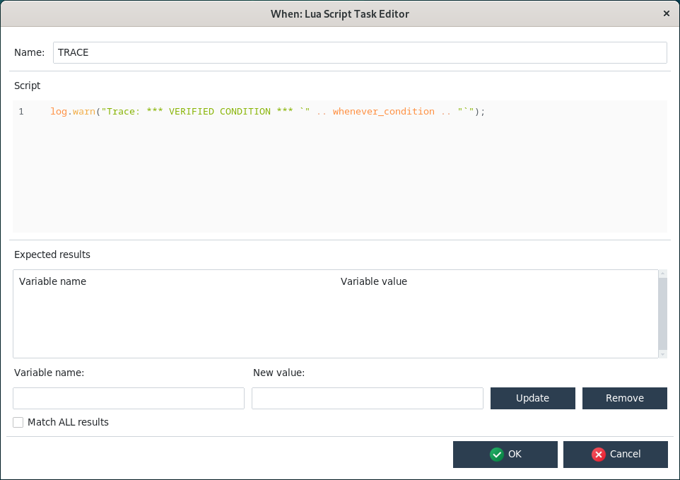

# Tutorial

Dealing with **When** forms for the various kinds of items, with all the parameters that are available for each item type -- especially for the standard items that form the base for more specialized ones -- can actually be tough: **When** and **whenever** are designed to be flexible, and flexibility comes at the cost of having many options to configure each task, condition, and possibly event that **whenever** should listen to.

In this chapter I will try to illustrate some real life use cases of **When**, step by step: in fact these use cases come from what I use (or have been using) it for.

The proposed examples are the following:

* implementation of a [simple trace](#simple-trace) task
* how to easily [automate backups](#automated-backups)
* [cleanup](#temporary-files-cleanup) some temporary files

and every example start by invoking the main configuration window:


either from the [command line](cli.md) or by selecting _Configurator_ from the menu while **When** is [running in the background](tray.md).

The examples assume that **When** has been installed using the [suggested method](install.md), and that, therefore, **whenever** is also available.


## Simple Trace

It's sometimes useful to have the ability to trace the configuration of one or more conditions for debug puropses: configuring a condition can sometimes be awful, especially when it is one of the most complex ones (such as a [command](cond_actionrelated.md#command) or a [Lua](cond_actionrelated.md#lua-script) based condition), and you might just want to test your condition with no side effects other than dropping a line to the log. For this I use a simple _trace_ task, consisting in a minimal Lua script:

```lua
log.warn("Trace: *** VERIFIED CONDITION *** `" .. whenever_condition .. "`");
```

that exploits the [abilities](https://github.com/almostearthling/whenever/tree/development?tab=readme-ov-file#lua-script-tasks) of the internal Lua interpreter to

* access the name of the condition that triggered it
* write log messages at different severity levels.

To create such a task, we only need to click _New_ in the main configuration window (which can be accessed either from the popup menu of a running instance, or by typing `when config` in a terminal or console window), and select a _Lua Script Based Task_ from the list:


then change the name to _TRACE_ (or whatever else that is meaningful: just remember that item names must begin with a letter, followed by alphanumeric characters and underscores, and that these names are case sensitive) and paste the script found above in the task editor _Script_ section:



Since this is just a _trace_ task, we do not need to check any result, thus we just click ok. Just for the sake of completing the process, we will also define a condition to trigger the _TRACE_ task every minute. In the main configuration window, click _New_, and in the item type dialog select first _Condition_ in the upper part, and then select _Interval Based Condition_ and click _OK_. The condition editor is opened: conditions are more complex than tasks, and the editor form has two tabs, of which the first is for common parameters, and the second for parameters that are specific for this type of condition. The name and the tasks to be run belong to the common part, so we change the name to something meaningful (in our example it is _Periodic_60sec_). Since we want to run the task periodically, we must also ensure that the _Check condition recurrently_ has a tick, otherwise the _TRACE_ task will run only once, a minute after _When_ has started. After this, we select _TRACE_ from the drop down list labeled _Task_ and click the _Add_ button at its right. The scenario is now the following:


and we still have to specify the "one minute" part. Being this specific to _interval_ based conditions, we can find it in the other section, corresponding to the _Specific parameters_ tab:


We only have to enter _1_ in the input box, and leave the unit of measure drop down list alone, as it defaults to _minutes_. Now we can click _OK_ and, when back to the main configuration box, click on _Save_ to save our changes: **When** may ask us to confirm that we want to overwrite the file if present, which is true most of the times. Since the configuration file cannot be saved elsewhere, so we have to answer positively unless we want to discard it.

If the configuration utility had been launched through a [running instance](tray.md) of **When**, then a _Reload_ button is available: this can be used to force the new configuration to be reloaded and the new items to be active immediately without the need to restart **When**. If you do not click _Reload_ (or if you don't confirm), the new configuration will be available at the next start of **When** -- usually, after the subsequent login.

> **Note**: This example corresponds to the basic initial configuration that is suggested in the **whenever** installation instructions, that can be found in its [releases](https://github.com/almostearthling/whenever/releases/latest/) pages and in the binary distribution.


## Automated Backups

In this example I will use [restic](https://restic.net/) as a personal backup tool: it is a great piece of software, which offers features normally available in professional backup systems in a streamlined CLI interface, can be used with an unimaginable amount of backends directly or by means of another great utility, that is [rclone](https://rclone.org/). Both are open source, and both are very actively developed. I'll assume that you already [installed](https://restic.readthedocs.io/en/stable/020_installation.html) _restic_ to [initialize](https://restic.readthedocs.io/en/stable/030_preparing_a_new_repo.html) a repository, for instance on a locally mounted SD card on a Windows PC. The process is as easy as the following interactive CLI session (via the _Terminal_ app or by manually starting `cmd`):

```text
C:\Users\username> restic init --repo E:\Backups\bk_username
enter password for new repository:
enter password again:
created restic repository c0f1bad70e at E:\Backups\bk_username
Please note that knowledge of your password is required to access the repository.
Losing your password means that your data is irrecoverably lost.
```

When prompted, you should type and confirm a password: let's assume you chose the string `s3cr3t1!`. `E:` is assumed to be the drive letter assigned to the mounted SD card, `Backups\bk_username` is a directory of your choice on that drive. `username` can be replaced with your account name: I find it sensible to have a directory dedicated to your account for a local backup, but it is a matter of taste. Of course you should keep your password, for instance by preserving it via a password manager.

We will use the environment variable method to let _restic_ know where the repository is, and its password. This means we should define the following environment variables with the respective values:

* `RESTIC_REPOSITORY`: `E:\Backups\bk_username`
* `RESTIC_PASSWORD`: `s3cr3t1!`

As we do not want to pollute the environment, we will set tese variables directly in the task definitions. We will define two tasks:

1. the first task will actually backup some directories,
2. the second task will perform some backup repository maintenance.

We want to backup our _Documents_ and our _Pictures_ directories: on Windows they are located respectively in `C:\Users\username\Documents` and `C:\Users\username\Pictures`.

> **Note**: Depending on the amount of data, the first backup can take quite a long time in order to be carried out: consider the option of forcing a full backup by issuing the command `restic backup Documents Pictures` from the command line in your home directory, before automating it using **When**.

First off, we launch the configuration utility: if the program icons for **When** had been created as described in the installation instructions, then clicking _Configure When_ on the desktop or in the _Start_ menu should be sufficient. Other options are to launch `when config` from the command line or, if there is an instance of **When** running, to right-click the clock-shaped system tray icon, and to select _Configurator_ from the context menu. The result is the same, apart from what we'll see below for the latter, that is the configuration GUI utility is launched, and we will click the _New_ button, which in turn allows us to select a _Command Based Task_:


Clicking _OK_ takes us to the specific task editor. We choose to start _restic_ in the home directory, in order to only mention subdirectories on the command line: this can be done by specifying the home directory in the _Working Folder_ text entry, which can also be done by selecting it via the three-dotted button on its right side. Actually, for new _Command Based Tasks_, **When** proposes the home directory as the default value for this entry, so in our case it can be just left as it is.

We have to define the two aforementioned variables in our task environment: to do so, for each of them, the name (which on Windows is not case sensitive, but it could be better to respect the casing specified in the _restic_ documentation just to be sure) has to be written in the entry labeled _Variable Name_, the value in the one labeled _New Value_, and then the _Update_ button has to be clicked. Clicking _Update_ either sets a new variable (if the name is not present) or updates an existing one.

Before clicking _OK_ the form should be configured as follows:


The reason why we chose to check for a failure in _restic_ and that such failure only occurs with an exit code of _1_ is that this is the exit code that _restic_ uses to inform that no snapshot could be taken at all. Since some files could be open during backup (it should be unattended, after all), maybe _restic_ will not be able to backup really everything. So we consider our backup to be a failure only when it is a _complete_ failure.

We could have accepted the suggested name for the task, something similar to _CommandTask_086F5F6C49_, but it would have been hardly recognizable when defining under which conditions it should take place.

We also want to perform some maintenance after we backed up our stuff. Namely we would save some space by keeping:

* one snapshot per day for the last 7 days
* 4 weekly snapshots before the daily ones (thus, roughly one month)
* at least one year of monthly snapshots
* 3 other snapshots in the past, one per year.

Yes, _restic_ [allows us to do so](https://restic.readthedocs.io/en/stable/060_forget.html#removing-snapshots-according-to-a-policy): everybody loves _restic_ and this is not a surprise to me. Following the documentation we should build a command line like the following:

```shell
restic --quiet forget --keep-daily 7 --keep-weekly 4 --keep-monthly 12 --keep-yearly 3 --prune
```

which translates to the following form:


where the other entries are absolutely similar to the ones provided for the backup task, except that we expect _restic_ to return a zero exit code for success: this is a repository-only operation, and every unusual outcome should be notified. We will call this task _Backup_Maintenance_.

Ideally, the backup task should be run before the maintenance one. Also ideally, the maintenance task should be not performed if the backup task fails: we could lose a backup without replacing it with a new one, and we would like to avoid it.

Now it's time to decide _when_ our backups have to take place: backups can be a lengthy (and noisy, considering fans) operation, thus I usually prefer that they are performed when I'm not using my laptop. So we will configure a condition that roughly indicates that we are away for a coffee. An idle time of three minutes should be enough for that. Moreover, choose not to backup more than once per session.

We click on _New_ again, and this time we select _Condition_ as item type, _Idle Session Based Condition_ in the list, and then click _OK_.


In the _Common parameters_ section we specify the tasks that have to be executed: we choose them from the drop down list below the list of active tasks, _first_ we choose the backup task and add it, _then_ the maintenance task:


Since we do not want multiple backups in a session, we ensure that the _Check condition recurrently_ box is not checked; as backups are something critical and we do not want to mess up things in case of an error, we leave _0_ in the _Max tasks retries_ field, so that **When** will not insist in running our backup routine when something goes wrong. The tasks have to be run sequentially: _restic_ can perform one operation at a time, so we leave that option intact. And we also choose to stop execution if a task fails because, as we said above, we do not want to perform the maintenance step when a backup has failed.


We name the condition _AwayFromKeyboard01_Once_: I prefer to use the _Once_ suffix for non recurrent conditions, in order to be sure that conditions that have triggered their tasks only once were actually intended to do so.

The only thing that is left is to specify that the task sequence has to take place after three minutes of idle time, so we move to the _Specific parameters_ tab:


Here we just write _3_ in the only available text entry: _minutes_ is the default unit of measure for time and can be left alone. Now we can press _OK_ and then, in the main configuration form, click the _Save_ button (we answer positively when possibly asked to overwrite the existing file): the next time **When** is started as resident frontend for **whenever**, our unattended backup routine will be scheduled for when we leave the workstation alone for three minutes. In case the configuration utility was accessed through the system tray menu, the configuration form will include a _Reload_ button which, when clicked, reloads the configuration file (after saving it) and dynamically adds the new condition and the two tasks, that will be immediately active in the running instance of the scheduler.


## Temporary Files Cleanup

This example was in the original **When** tutorial, I found it useful on Linux because many utilities leave temporary backups (those files that end with a _tilde_ `~` character) when you modify a file by default. On one hand I didn't want to modify the default settings of all of these utilities, and on the other I didn't like to find my _Documents_ folder full of these files that I had to find and remove from time to time.

This example takes place on an up-to-date Linux machine, assuming a working Gnome on X.org desktop session, and a simple shell script will be used as the cleanup command. It also assumes that the CLI command to move files to the _Trash_ bin is installed, in order to avoid to completely remove these files, as they could be useful anyway in some cases. If the `trash` command is not available, the following command can be used on Debian based distributions:

```shell
sudo apt install trash-cli
```

On other distributions something similar should be available. We will create a shell script in the _~/.local/bin_ directory: if **When** was installed via _pipx_ according to the [installation instructions](install.md) this directory should be already present and in the _PATH_. So the following commands can be run in a terminal window:

```shell
cd ~/.local/bin
nano housekeep.sh
```

which open the popular _nano_ editor for our _housekeep.sh_ script. We enter the following code in the editor:

```shell
#!/bin/sh
find . -path ./.local/share/Trash -prune \
    -o -type f -name '*~' \
    -exec echo '{}' \; \
    -exec trash -f '{}' \;
```

and save the file hitting _Ctrl+S_, then _Ctrl+X_ to exit the editor. The reason for the `-path ./.local/share/Trash -prune` line is that, since this script could be started in any directory, including the home directory (where _./.local/share/Trash_ is found), we do not want the script to handle files already in the _Trash_ bin again. Of course, being this a single command, the same command could have been placed directly in the _command_ section of a [Command Based Task](tasks.md#command), but a small script does not really introduce extra costs and makes things somewhat more clear. At last we change permissions for the script, in order for it to be executable:

```shell
chmod a+x housekeep.sh
```

while still in the _~/.local/bin_ directory. We move back to the home directory and launch the configuration utility:

```shell
cd
when config
```

Of course, if **When** is already running, the tray icon can be clicked and _Configurator_ can be selected in the popup [menu form](tray.md#menu-form). The task has to be created first, and clicking _New_ and selecting a command based task as in the previous example brings up the command task editor form. We just change the name of the task to be something more understandable, point to the script as our command and set the working directory:


Note that the _Command_ entry shows the full path of our command: this is because I used the three-dotted button at the side of the entry to open a dialog box that allows to look for the executable file. Actually, if _housekeep.sh_ is in the _PATH_ as expected, we could just type `housekeep.sh` in the entry itself.

We leave all other parameters alone, because the script takes no arguments and does not explicitly return anything meaningful. What we want is for it to run from time to time regardless of the outcome: if one or more files could not be sent to the bin, it probably will happen the next time the script runs. Now we set up a condition to tell **whenever** in which case the script has to be run. The script is in fact very lightweight, and it will probably never really bother us. However, running it on a strict (and possibly tight) time schedule might be overkill: some other possible choices that do not depend on time are

1. on idle time
2. when the workstation isn't really working a lot
3. when a file in the _~/Documents_ directory is modified.

We used the first type of condition in the previous example. The third one might be interesting, but it can lead to a lot of work, especially if the contents of the folder change often (which is likely to happen). So we go for the second option: we click _New_ again, select _Condition_ as item type, and choose a [System Load Below Threshold Condition](cond_extra01.md#system-load):


Clicking _OK_ takes us to the condition editor. In the common section we change the condition name and specify the task to be run, by selecting it from the drop down list. It will be the only task, so every other common option has little or no influence, and we leave them as per default:


The name is now _SystemLoad_HouseKeeping_, which is meaningful enough for us. We also checked the _Check condition recurrently_ option: we said that we want to run the script from time to time during the session, and leaving the option unchecked means that the script will be executed only once per session -- that is, after the first _successful_ condition check, no more checks will take place.[^1]

Going to the common section, we can leave the value for the _Load is Below_ entry as _3%_ (that is, the default): it is quite low but not completely unlikely to happen on most modern workstations. Of course your case could be different, and a higher value might be more appropriate.


After clicking _OK_ we are done: we can now save our new configuration and it will be active at the next start of **When**. Or, as in the previous example, **When** can reload the configuration by clicking the _Reload_ button -- which is available if the configuration has been edited accessing the configuration utility from the popup menu in a running **When** instance.


## Conclusion

There are many ways to use **When** as an automation tool, this tutorial only shows some of them. Possibly, with time, the tutorial will be further enriched with other examples, to help build other, possibly more complex "action flows" which can be useful in everydays activity: the tutorial is an ongoing task.


## See Also

* [Installation](install.md)
* [Tasks](tasks.md)
* [Conditions](conditions.md)
* [Events](events.md)


[`◀ Main`](main.md)


[^1]: Unless task outcomes are taken into account, and **whenever** is instructed to insist checking the condition until associated tasks run successfully.
